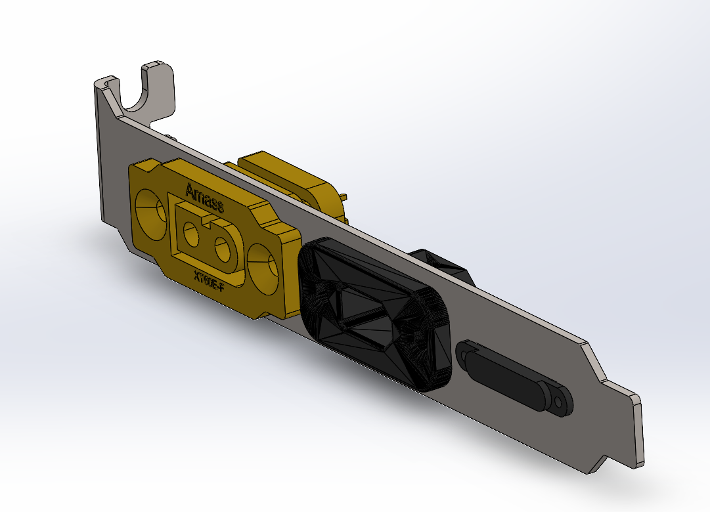
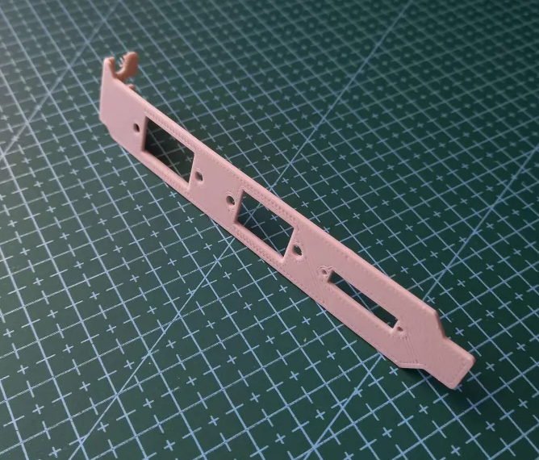
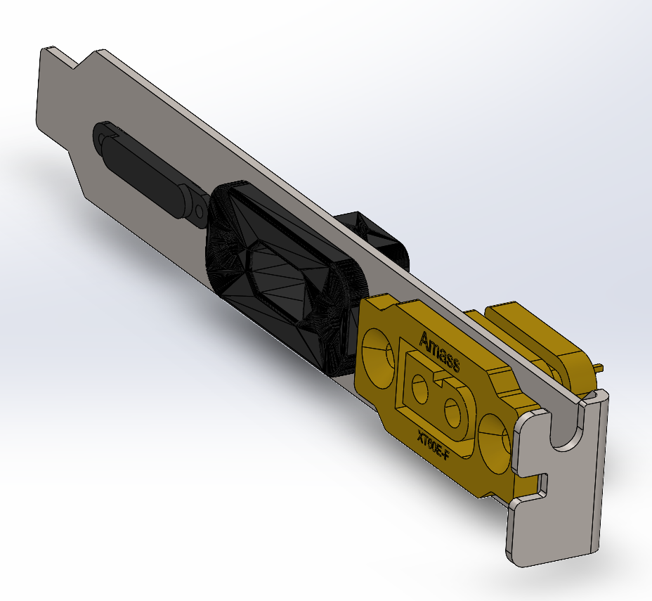
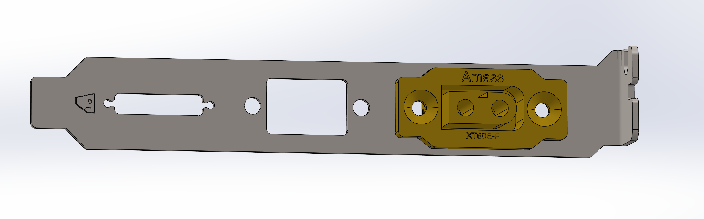
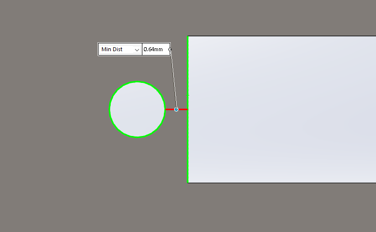

# PCIE Bracket

## Version 1.0

Created the first version, made a test print to check the fit.
<table>
  <tr>
    <td></td>
    <td></td>
  </tr>
</table>

### Problems
- It is slightly to long, the tip should be shortened a little bit (<1mm).
- The entire thing is backwards

## Version 2.0

Made the part slightly smaller.

Flipped the connectors.

 <

 ## Version 2.1
 Slightly increased the clearance for the holes based on [this guide](https://www.trfastenings.com/Knowledge-Base/Engineering-Data/tapping-sizes-and-clearance-holes).

 ## Version 2.2
 - Added an embossed Shark1.
 - Filleted the main cutouts. 
 - Added a slot to remove the 0.8mm wall.
  
 <

 # Ordering
 ## Ordering V2.1
 Ordering from [JLC3DP](https://jlc3dp.com/).
 
 Material is Titanium TC4, costs around USD $10.

There was a File Error when ordering, `< 0.8mm wall thickness detected` 
This was from the small hole for the magnetic connector.

There is the option to go ahead and accept the risks, this would probably be fine as there is not much force on this part. 

This order was canaled here to address this issue and there more some more changes that should be made.

## Ordering V2.2

There was still the issue with the wall thickness, I accepted the risks.

The part cost USD $10.11, the review was completed by the next day.

Expected to take 4 days to make, shipping should be around a week.

# Review
## Version 2.2
